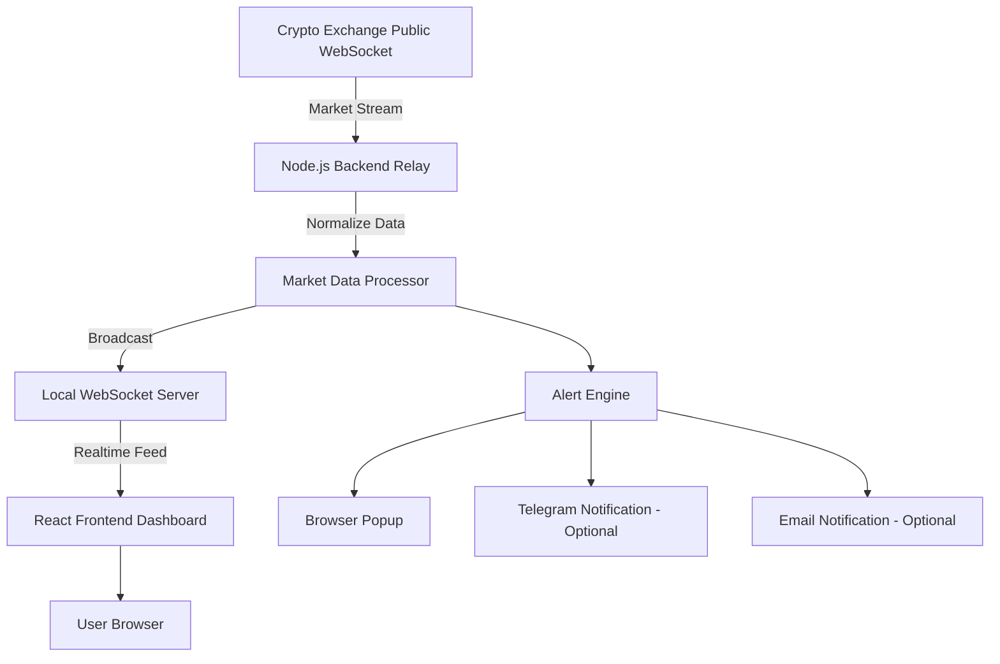

# Architecture Diagram

## Data Flow

1. Backend connects to exchange public WebSocket.
2. Backend receives raw ticker/order book data.
3. Backend normalizes data format.
4. Backend broadcasts data to connected frontend clients.
5. Frontend updates UI without page refresh.
6. Alert engine checks custom rules.

## Production Notes

- Use PM2 or Docker for backend process management.
- Use HTTPS/WSS for production deployment.
- Add Redis if the dashboard grows into multi-instance architecture.
- Add database if historical data is required.
