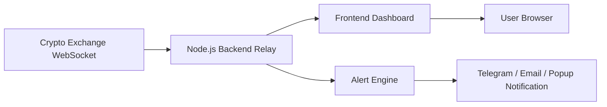

# Proposal Project: Realtime Crypto Market Dashboard

## 1. Ringkasan Project

Realtime Crypto Market Dashboard adalah aplikasi berbasis web untuk memantau harga cryptocurrency secara realtime melalui koneksi WebSocket. Dashboard ini dirancang agar pengguna dapat melihat pergerakan harga, perubahan persentase, order book, dan menerima notifikasi ketika kondisi market tertentu tercapai.

Project ini menggunakan arsitektur backend relay agar koneksi realtime lebih stabil dibandingkan koneksi langsung dari browser ke exchange.

## 2. Tujuan Project

Membangun dashboard crypto yang ringan, realtime, stabil, dan scalable untuk kebutuhan monitoring market tanpa harus membuka aplikasi exchange secara langsung.

## 3. Fitur Utama

### Realtime Last Price
Menampilkan harga terakhir pair crypto seperti BTCUSDT, ETHUSDT, dan pair lain secara live.

### Price Change
Menampilkan perubahan harga dalam bentuk persentase, dengan indikator naik atau turun.

### Order Book Realtime
Menampilkan data bid dan ask dari market spot secara realtime.

### Market Alert
Memberikan notifikasi jika harga melewati batas tertentu, misalnya BTCUSDT lebih dari 70000.

### Multi Pair Support
Dashboard dapat dikembangkan untuk beberapa pair crypto sekaligus.

## 4. Arsitektur Sistem

## 5. Teknologi yang Digunakan

### Frontend
- React.js
- TailwindCSS
- WebSocket Client
- Vite

### Backend
- Node.js
- Express.js
- ws WebSocket
- dotenv
- cors

### Data Source
- Public WebSocket API crypto exchange, seperti Binance, Bybit, Coinbase, atau OKX.

## 6. Alur Kerja Sistem

1. Backend Node.js membuka koneksi WebSocket ke exchange.
2. Exchange mengirim data harga, order book, dan perubahan market.
3. Backend memproses dan menstabilkan data.
4. Backend melakukan broadcast ke frontend.
5. Frontend menampilkan data realtime ke user browser.
6. Alert engine mengecek kondisi harga dan mengirim notifikasi jika syarat terpenuhi.

## 7. Kendala Teknis dan Solusi

Kendala utama adalah koneksi WebSocket exchange yang sering tertutup ketika diakses langsung dari frontend browser. Hal ini bisa disebabkan oleh restriction jaringan, proteksi exchange, rate limit, atau pembatasan direct browser connection.

Solusi yang digunakan adalah backend relay WebSocket. Dengan cara ini, frontend tidak langsung terhubung ke exchange, melainkan menerima data dari server backend sendiri.

## 8. Keunggulan Solusi

- Lebih stabil untuk realtime streaming.
- Mendukung auto reconnect.
- Logic dan konfigurasi tidak terekspos di frontend.
- Lebih mudah dikembangkan menjadi multi exchange.
- Siap dikembangkan menjadi trading bot, AI signal, atau historical market database.

## 9. Estimasi Modul Pengembangan

| Modul | Deskripsi |
|---|---|
| Backend Relay | Server Node.js untuk menerima dan meneruskan data WebSocket |
| Frontend Dashboard | Tampilan harga, chart sederhana, order book, dan alert |
| Alert Engine | Sistem pengecekan kondisi harga |
| Deployment | Konfigurasi production hosting |
| Documentation | README, setup guide, dan diagram arsitektur |

## 10. Output Project

- Source code backend Node.js.
- Source code frontend React Tailwind.
- Dokumentasi setup.
- Diagram arsitektur.
- Proposal teknis.

## 11. Kesimpulan

Project ini merupakan dashboard monitoring crypto realtime berbasis web dengan arsitektur production-ready menggunakan backend relay WebSocket. Sistem ini cocok untuk kebutuhan monitoring market, portfolio freelance, dan pengembangan lanjutan ke sistem trading realtime.
